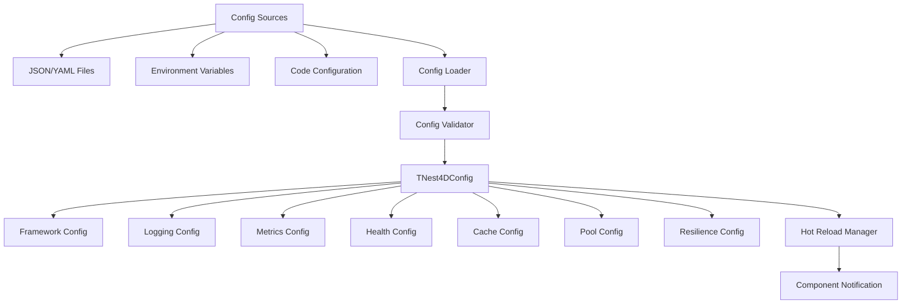

# Sistema Centralizado de Configuração - Nest4D

## 1. Análise do Problema Atual

### 1.1 Configurações Dispersas

Atualmente, o Nest4D possui configurações espalhadas em múltiplos arquivos e componentes:

```pascal
// Horse Framework
TNest4DHorseConfig = record
  EnableMetrics: Boolean;
  EnableLogging: Boolean;
  EnableHealthChecks: Boolean;
  EnableInterceptors: Boolean;
  EnableResilience: Boolean;
  LogLevel: TLogLevel;
  MetricsEndpoint: String;
  HealthEndpoint: String;
  ResilienceEndpoint: String;
  SlowRequestThresholdMs: Integer;
  ResilienceConfig: String;
end;

// Handler Pool
TPoolConfig = class
  MinSize: Integer;
  MaxSize: Integer;
  IdleTimeout: Integer;
  GrowthFactor: Double;
  CleanupInterval: Integer;
  MaxIdleTime: Integer;
  ForceCleanupThreshold: Integer;
  EnablePeriodicCleanup: Boolean;
  ShortTermTimeout: Integer;
  LongTermTimeout: Integer;
  MemoryPressureTimeout: Integer;
  AdaptiveTimeout: Boolean;
end;

// Cache System
TCacheConfig = record
  PropertyTTLSeconds: Integer;
  BodyTTLSeconds: Integer;
  ParamTTLSeconds: Integer;
  QueryTTLSeconds: Integer;
  CleanupIntervalSeconds: Integer;
  EnableTTL: Boolean;
  EnableBackgroundCleanup: Boolean;
end;
```

### 1.2 Problemas Identificados

1. **Fragmentação**: Configurações espalhadas em diferentes arquivos
2. **Inconsistência**: Diferentes padrões de configuração
3. **Manutenção Complexa**: Difícil localizar e modificar configurações
4. **Duplicação**: Configurações similares em múltiplos locais
5. **Falta de Validação**: Ausência de validação centralizada
6. **Dificuldade de Versionamento**: Controle de versão fragmentado

## 2. Solução: Sistema Centralizado de Configuração

### 2.1 Arquitetura Proposta



### 2.2 Estrutura Unificada

```pascal
unit nest4d.config;

interface

uses
  System.SysUtils,
  System.Classes,
  System.Generics.Collections,
  nest4d.logging,
  nest4d.metrics;

type
  // Configuração de Logging
  TLoggingConfig = record
    Enabled: Boolean;
    Level: TLogLevel;
    OutputFormat: String; // 'json', 'text', 'structured'
    Appenders: TArray<String>; // 'console', 'file', 'database'
    FileConfig: record
      Path: String;
      MaxSize: Int64;
      MaxFiles: Integer;
      Rotation: String; // 'daily', 'size', 'none'
    end;
    DatabaseConfig: record
      ConnectionString: String;
      TableName: String;
      BatchSize: Integer;
    end;
    
    class function Default: TLoggingConfig; static;
  end;
  
  // Configuração de Métricas
  TMetricsConfig = record
    Enabled: Boolean;
    CollectionInterval: Integer; // ms
    Exporters: TArray<String>; // 'console', 'prometheus', 'influxdb'
    Endpoints: record
      Metrics: String;
      Health: String;
      Resilience: String;
    end;
    PrometheusConfig: record
      Port: Integer;
      Path: String;
      EnableAuth: Boolean;
    end;
    InfluxDBConfig: record
      URL: String;
      Database: String;
      Username: String;
      Password: String;
      BatchSize: Integer;
    end;
    
    class function Default: TMetricsConfig; static;
  end;
  
  // Configuração de Health Checks
  THealthConfig = record
    Enabled: Boolean;
    CheckInterval: Integer; // ms
    Timeout: Integer; // ms
    Checks: TArray<String>; // 'memory', 'database', 'external'
    Thresholds: record
      MemoryUsagePercent: Double;
      DiskUsagePercent: Double;
      ResponseTimeMs: Integer;
    end;
    
    class function Default: THealthConfig; static;
  end;
  
  // Configuração de Cache
  TCacheConfig = record
    Enabled: Boolean;
    DefaultTTL: Integer; // seconds
    MaxSize: Integer; // entries
    CleanupInterval: Integer; // seconds
    EnableBackgroundCleanup: Boolean;
    TTLByType: record
      Property: Integer;
      Body: Integer;
      Param: Integer;
      Query: Integer;
    end;
    
    class function Default: TCacheConfig; static;
  end;
  
  // Configuração de Pool de Handlers
  TPoolConfig = record
    Enabled: Boolean;
    MinSize: Integer;
    MaxSize: Integer;
    IdleTimeout: Integer; // ms
    GrowthFactor: Double;
    CleanupInterval: Integer; // ms
    MaxIdleTime: Integer; // ms
    ForceCleanupThreshold: Integer;
    EnablePeriodicCleanup: Boolean;
    TimeoutStrategy: record
      ShortTerm: Integer;
      LongTerm: Integer;
      MemoryPressure: Integer;
      Adaptive: Boolean;
      Multiplier: Double;
      MinThreshold: Integer;
      MaxThreshold: Integer;
    end;
    
    class function Default: TPoolConfig; static;
  end;
  
  // Configuração de Resiliência
  TResilienceConfig = record
    Enabled: Boolean;
    DefaultPolicy: String; // 'Default', 'HighAvailability', 'FastFail', 'Bulkhead'
    Retry: record
      MaxAttempts: Integer;
      BaseDelay: Integer; // ms
      MaxDelay: Integer; // ms
      BackoffStrategy: String; // 'exponential', 'linear', 'fixed'
      Jitter: Boolean;
    end;
    CircuitBreaker: record
      FailureThreshold: Integer;
      RecoveryTimeout: Integer; // ms
      HalfOpenMaxCalls: Integer;
    end;
    Fallback: record
      Enabled: Boolean;
      Timeout: Integer; // ms
    end;
    
    class function Default: TResilienceConfig; static;
  end;
  
  // Configuração de Framework
  TFrameworkConfig = record
    EnableInterceptors: Boolean;
    EnableMiddleware: Boolean;
    SlowRequestThreshold: Integer; // ms
    RequestTimeout: Integer; // ms
    MaxRequestSize: Int64; // bytes
    EnableCORS: Boolean;
    CORSConfig: record
      AllowedOrigins: TArray<String>;
      AllowedMethods: TArray<String>;
      AllowedHeaders: TArray<String>;
      MaxAge: Integer;
    end;
    
    class function Default: TFrameworkConfig; static;
  end;
  
  // Configuração Principal Unificada
  TNest4DConfig = class
  private
    FLogging: TLoggingConfig;
    FMetrics: TMetricsConfig;
    FHealth: THealthConfig;
    FCache: TCacheConfig;
    FHandlerPool: TPoolConfig;
    FResilience: TResilienceConfig;
    FFramework: TFrameworkConfig;
    FEnvironment: String;
    FVersion: String;
    FConfigSources: TArray<String>;
    FLastModified: TDateTime;
    FValidationErrors: TArray<String>;
    
    procedure ValidateConfiguration;
    procedure NotifyConfigChange;
  public
    constructor Create;
    destructor Destroy; override;
    
    // Métodos de carregamento
    procedure LoadFromFile(const AFileName: String);
    procedure LoadFromJSON(const AJSONString: String);
    procedure LoadFromEnvironment;
    procedure LoadFromCode(const AConfigProc: TProc<TNest4DConfig>);
    
    // Métodos de validação
    function Validate: Boolean;
    function GetValidationErrors: TArray<String>;
    
    // Métodos de persistência
    procedure SaveToFile(const AFileName: String);
    function ToJSON: String;
    
    // Hot reload
    procedure EnableHotReload(const AInterval: Integer = 5000);
    procedure DisableHotReload;
    
    // Configurações padrão
    class function CreateDefault: TNest4DConfig; static;
    class function CreateDevelopment: TNest4DConfig; static;
    class function CreateProduction: TNest4DConfig; static;
    class function CreateTesting: TNest4DConfig; static;
    
    // Propriedades
    property Logging: TLoggingConfig read FLogging write FLogging;
    property Metrics: TMetricsConfig read FMetrics write FMetrics;
    property Health: THealthConfig read FHealth write FHealth;
    property Cache: TCacheConfig read FCache write FCache;
    property HandlerPool: TPoolConfig read FHandlerPool write FHandlerPool;
    property Resilience: TResilienceConfig read FResilience write FResilience;
    property Framework: TFrameworkConfig read FFramework write FFramework;
    property Environment: String read FEnvironment write FEnvironment;
    property Version: String read FVersion write FVersion;
    property ConfigSources: TArray<String> read FConfigSources;
    property LastModified: TDateTime read FLastModified;
  end;
  
  // Gerenciador de Configuração Global
  TNest4DConfigManager = class
  private
    class var FInstance: TNest4DConfigManager;
    class var FConfig: TNest4DConfig;
    class var FHotReloadEnabled: Boolean;
    class var FHotReloadThread: TThread;
    
    class constructor Create;
    class destructor Destroy;
  public
    class function Instance: TNest4DConfigManager;
    class function Config: TNest4DConfig;
    class procedure SetConfig(const AConfig: TNest4DConfig);
    class procedure LoadConfig(const AFileName: String = '');
    class procedure ReloadConfig;
  end;

implementation
```

## 3. Sistema de Configuração Hierárquica

### 3.1 Ordem de Precedência

1. **Configuração por Código** (Maior prioridade)
2. **Variáveis de Ambiente**
3. **Arquivo de Configuração Local** (config.local.json)
4. **Arquivo de Configuração por Ambiente** (config.{env}.json)
5. **Arquivo de Configuração Padrão** (config.json)
6. **Configuração Padrão do Framework** (Menor prioridade)

### 3.2 Estrutura de Arquivos

```
config/
├── config.json                 # Configuração base
├── config.development.json     # Configuração de desenvolvimento
├── config.production.json      # Configuração de produção
├── config.testing.json         # Configuração de testes
├── config.local.json          # Configuração local (ignorado pelo git)
└── schemas/
    └── config.schema.json      # Schema de validação
```

### 3.3 Exemplo de Configuração JSON

```json
{
  "environment": "development",
  "version": "1.0.0",
  "logging": {
    "enabled": true,
    "level": "info",
    "outputFormat": "structured",
    "appenders": ["console", "file"],
    "fileConfig": {
      "path": "./logs/nest4d.log",
      "maxSize": 10485760,
      "maxFiles": 5,
      "rotation": "daily"
    }
  },
  "metrics": {
    "enabled": true,
    "collectionInterval": 1000,
    "exporters": ["console", "prometheus"],
    "endpoints": {
      "metrics": "/metrics",
      "health": "/health",
      "resilience": "/resilience"
    },
    "prometheusConfig": {
      "port": 9090,
      "path": "/metrics",
      "enableAuth": false
    }
  },
  "health": {
    "enabled": true,
    "checkInterval": 30000,
    "timeout": 5000,
    "checks": ["memory", "database"],
    "thresholds": {
      "memoryUsagePercent": 80.0,
      "diskUsagePercent": 90.0,
      "responseTimeMs": 1000
    }
  },
  "cache": {
    "enabled": true,
    "defaultTTL": 300,
    "maxSize": 1000,
    "cleanupInterval": 60,
    "enableBackgroundCleanup": true,
    "ttlByType": {
      "property": 300,
      "body": 600,
      "param": 180,
      "query": 120
    }
  },
  "handlerPool": {
    "enabled": true,
    "minSize": 5,
    "maxSize": 50,
    "idleTimeout": 30000,
    "growthFactor": 1.5,
    "cleanupInterval": 60000,
    "maxIdleTime": 300000,
    "forceCleanupThreshold": 100,
    "enablePeriodicCleanup": true,
    "timeoutStrategy": {
      "shortTerm": 5000,
      "longTerm": 30000,
      "memoryPressure": 2000,
      "adaptive": true,
      "multiplier": 1.2,
      "minThreshold": 1000,
      "maxThreshold": 60000
    }
  },
  "resilience": {
    "enabled": true,
    "defaultPolicy": "Default",
    "retry": {
      "maxAttempts": 3,
      "baseDelay": 1000,
      "maxDelay": 10000,
      "backoffStrategy": "exponential",
      "jitter": true
    },
    "circuitBreaker": {
      "failureThreshold": 5,
      "recoveryTimeout": 30000,
      "halfOpenMaxCalls": 3
    },
    "fallback": {
      "enabled": true,
      "timeout": 5000
    }
  },
  "framework": {
    "enableInterceptors": true,
    "enableMiddleware": true,
    "slowRequestThreshold": 1000,
    "requestTimeout": 30000,
    "maxRequestSize": 10485760,
    "enableCORS": true,
    "corsConfig": {
      "allowedOrigins": ["*"],
      "allowedMethods": ["GET", "POST", "PUT", "DELETE", "OPTIONS"],
      "allowedHeaders": ["Content-Type", "Authorization"],
      "maxAge": 86400
    }
  }
}
```

## 4. Configuração via Variáveis de Ambiente

### 4.1 Convenção de Nomenclatura

```bash
# Formato: NEST4D_{SECAO}_{PROPRIEDADE}
NEST4D_LOGGING_ENABLED=true
NEST4D_LOGGING_LEVEL=info
NEST4D_METRICS_ENABLED=true
NEST4D_METRICS_COLLECTION_INTERVAL=1000
NEST4D_CACHE_DEFAULT_TTL=300
NEST4D_HANDLER_POOL_MIN_SIZE=5
NEST4D_HANDLER_POOL_MAX_SIZE=50
NEST4D_RESILIENCE_ENABLED=true
NEST4D_RESILIENCE_DEFAULT_POLICY=Default

# Configurações aninhadas
NEST4D_LOGGING_FILE_CONFIG_PATH=./logs/nest4d.log
NEST4D_METRICS_PROMETHEUS_CONFIG_PORT=9090
NEST4D_HEALTH_THRESHOLDS_MEMORY_USAGE_PERCENT=80.0
```

### 4.2 Implementação do Carregamento

```pascal
procedure TNest4DConfig.LoadFromEnvironment;
var
  LEnvValue: String;
begin
  // Logging
  LEnvValue := GetEnvironmentVariable('NEST4D_LOGGING_ENABLED');
  if LEnvValue <> '' then
    FLogging.Enabled := StrToBoolDef(LEnvValue, FLogging.Enabled);
    
  LEnvValue := GetEnvironmentVariable('NEST4D_LOGGING_LEVEL');
  if LEnvValue <> '' then
    FLogging.Level := StringToLogLevel(LEnvValue);
    
  // Metrics
  LEnvValue := GetEnvironmentVariable('NEST4D_METRICS_ENABLED');
  if LEnvValue <> '' then
    FMetrics.Enabled := StrToBoolDef(LEnvValue, FMetrics.Enabled);
    
  LEnvValue := GetEnvironmentVariable('NEST4D_METRICS_COLLECTION_INTERVAL');
  if LEnvValue <> '' then
    FMetrics.CollectionInterval := StrToIntDef(LEnvValue, FMetrics.CollectionInterval);
    
  // Cache
  LEnvValue := GetEnvironmentVariable('NEST4D_CACHE_DEFAULT_TTL');
  if LEnvValue <> '' then
    FCache.DefaultTTL := StrToIntDef(LEnvValue, FCache.DefaultTTL);
    
  // Handler Pool
  LEnvValue := GetEnvironmentVariable('NEST4D_HANDLER_POOL_MIN_SIZE');
  if LEnvValue <> '' then
    FHandlerPool.MinSize := StrToIntDef(LEnvValue, FHandlerPool.MinSize);
    
  // Resilience
  LEnvValue := GetEnvironmentVariable('NEST4D_RESILIENCE_ENABLED');
  if LEnvValue <> '' then
    FResilience.Enabled := StrToBoolDef(LEnvValue, FResilience.Enabled);
end;
```

## 5. Validação Automática de Configurações

### 5.1 Sistema de Validação

```pascal
procedure TNest4DConfig.ValidateConfiguration;
begin
  FValidationErrors := [];
  
  // Validação de Logging
  if FLogging.Enabled then
  begin
    if FLogging.FileConfig.MaxSize <= 0 then
      FValidationErrors := FValidationErrors + ['Logging.FileConfig.MaxSize deve ser maior que 0'];
      
    if FLogging.FileConfig.MaxFiles <= 0 then
      FValidationErrors := FValidationErrors + ['Logging.FileConfig.MaxFiles deve ser maior que 0'];
  end;
  
  // Validação de Métricas
  if FMetrics.Enabled then
  begin
    if FMetrics.CollectionInterval <= 0 then
      FValidationErrors := FValidationErrors + ['Metrics.CollectionInterval deve ser maior que 0'];
      
    if FMetrics.PrometheusConfig.Port <= 0 then
      FValidationErrors := FValidationErrors + ['Metrics.PrometheusConfig.Port deve ser maior que 0'];
  end;
  
  // Validação de Cache
  if FCache.Enabled then
  begin
    if FCache.DefaultTTL <= 0 then
      FValidationErrors := FValidationErrors + ['Cache.DefaultTTL deve ser maior que 0'];
      
    if FCache.MaxSize <= 0 then
      FValidationErrors := FValidationErrors + ['Cache.MaxSize deve ser maior que 0'];
  end;
  
  // Validação de Handler Pool
  if FHandlerPool.Enabled then
  begin
    if FHandlerPool.MinSize <= 0 then
      FValidationErrors := FValidationErrors + ['HandlerPool.MinSize deve ser maior que 0'];
      
    if FHandlerPool.MaxSize <= FHandlerPool.MinSize then
      FValidationErrors := FValidationErrors + ['HandlerPool.MaxSize deve ser maior que MinSize'];
      
    if FHandlerPool.GrowthFactor <= 1.0 then
      FValidationErrors := FValidationErrors + ['HandlerPool.GrowthFactor deve ser maior que 1.0'];
  end;
  
  // Validação de Resiliência
  if FResilience.Enabled then
  begin
    if FResilience.Retry.MaxAttempts <= 0 then
      FValidationErrors := FValidationErrors + ['Resilience.Retry.MaxAttempts deve ser maior que 0'];
      
    if FResilience.Retry.BaseDelay <= 0 then
      FValidationErrors := FValidationErrors + ['Resilience.Retry.BaseDelay deve ser maior que 0'];
      
    if FResilience.CircuitBreaker.FailureThreshold <= 0 then
      FValidationErrors := FValidationErrors + ['Resilience.CircuitBreaker.FailureThreshold deve ser maior que 0'];
  end;
end;
```

## 6. Hot Reload de Configurações

### 6.1 Implementação do Hot Reload

```pascal
type
  THotReloadThread = class(TThread)
  private
    FConfigFile: String;
    FLastModified: TDateTime;
    FInterval: Integer;
    FOnConfigChanged: TNotifyEvent;
  protected
    procedure Execute; override;
  public
    constructor Create(const AConfigFile: String; AInterval: Integer; AOnConfigChanged: TNotifyEvent);
  end;

procedure TNest4DConfig.EnableHotReload(const AInterval: Integer);
begin
  if not Assigned(FHotReloadThread) then
  begin
    FHotReloadThread := THotReloadThread.Create(
      FConfigFile,
      AInterval,
      OnConfigFileChanged
    );
    FHotReloadThread.Start;
  end;
end;

procedure TNest4DConfig.OnConfigFileChanged(Sender: TObject);
begin
  try
    LoadFromFile(FConfigFile);
    ValidateConfiguration;
    
    if Length(FValidationErrors) = 0 then
    begin
      NotifyConfigChange;
      if Assigned(GLogger) then
        GLogger.Info('Configuration reloaded successfully');
    end
    else
    begin
      if Assigned(GLogger) then
        GLogger.Error('Configuration reload failed: ' + String.Join(', ', FValidationErrors));
    end;
  except
    on E: Exception do
    begin
      if Assigned(GLogger) then
        GLogger.Error('Error reloading configuration: ' + E.Message);
    end;
  end;
end;
```

## 7. Benefícios da Centralização

### 7.1 Manutenção Facilitada

- **Localização Única**: Todas as configurações em um local centralizado
- **Consistência**: Padrão unificado para todas as configurações
- **Documentação**: Configurações autodocumentadas com schemas
- **Versionamento**: Controle de versão simplificado

### 7.2 Flexibilidade

- **Múltiplas Fontes**: JSON, YAML, variáveis de ambiente, código
- **Hierarquia**: Configurações por ambiente com herança
- **Hot Reload**: Alterações sem reinicialização
- **Validação**: Verificação automática de integridade

### 7.3 Observabilidade

- **Rastreamento**: Log de mudanças de configuração
- **Métricas**: Monitoramento de configurações ativas
- **Auditoria**: Histórico de alterações
- **Debugging**: Facilita identificação de problemas

## 8. Exemplos Práticos de Uso

### 8.1 Configuração Básica

```pascal
program Nest4DApp;

uses
  nest4d.config,
  nest4d.horse;

var
  LConfig: TNest4DConfig;
begin
  // Carrega configuração padrão
  LConfig := TNest4DConfig.CreateDevelopment;
  
  // Sobrescreve com arquivo de configuração
  LConfig.LoadFromFile('config/config.json');
  
  // Sobrescreve com variáveis de ambiente
  LConfig.LoadFromEnvironment;
  
  // Valida configuração
  if not LConfig.Validate then
  begin
    WriteLn('Erros de configuração:');
    for var LError in LConfig.GetValidationErrors do
      WriteLn('- ' + LError);
    Exit;
  end;
  
  // Configura o framework
  TNest4DConfigManager.SetConfig(LConfig);
  
  // Inicia aplicação
  THorse
    .Use(Nest4D_Horse(AppModule))
    .Listen(9000);
end.
```

### 8.2 Configuração Avançada

```pascal
// Configuração programática
var
  LConfig: TNest4DConfig;
begin
  LConfig := TNest4DConfig.CreateProduction;
  
  // Customiza logging
  LConfig.Logging.Enabled := True;
  LConfig.Logging.Level := llDebug;
  LConfig.Logging.Appenders := ['console', 'file', 'database'];
  LConfig.Logging.FileConfig.Path := '/var/log/nest4d/app.log';
  LConfig.Logging.FileConfig.Rotation := 'daily';
  
  // Customiza métricas
  LConfig.Metrics.Enabled := True;
  LConfig.Metrics.Exporters := ['prometheus', 'influxdb'];
  LConfig.Metrics.PrometheusConfig.Port := 9090;
  LConfig.Metrics.InfluxDBConfig.URL := 'http://influxdb:8086';
  LConfig.Metrics.InfluxDBConfig.Database := 'nest4d_metrics';
  
  // Customiza resiliência
  LConfig.Resilience.Enabled := True;
  LConfig.Resilience.DefaultPolicy := 'HighAvailability';
  LConfig.Resilience.Retry.MaxAttempts := 5;
  LConfig.Resilience.Retry.BackoffStrategy := 'exponential';
  
  // Habilita hot reload
  LConfig.EnableHotReload(5000);
  
  TNest4DConfigManager.SetConfig(LConfig);
end;
```

### 8.3 Configuração por Ambiente

```pascal
// config/config.development.json
{
  "logging": {
    "level": "debug",
    "appenders": ["console"]
  },
  "metrics": {
    "exporters": ["console"]
  },
  "handlerPool": {
    "minSize": 2,
    "maxSize": 10
  }
}

// config/config.production.json
{
  "logging": {
    "level": "warn",
    "appenders": ["file", "database"]
  },
  "metrics": {
    "exporters": ["prometheus", "influxdb"]
  },
  "handlerPool": {
    "minSize": 10,
    "maxSize": 100
  },
  "resilience": {
    "defaultPolicy": "HighAvailability"
  }
}
```

## 9. Migração do Sistema Atual

### 9.1 Plano de Migração

1. **Fase 1**: Criar estrutura centralizada
2. **Fase 2**: Migrar configurações existentes
3. **Fase 3**: Implementar validação e hot reload
4. **Fase 4**: Deprecar configurações antigas
5. **Fase 5**: Remover código legado

### 9.2 Compatibilidade Retroativa

```pascal
// Adapter para manter compatibilidade
function TNest4DHorseConfig.ToNest4DConfig: TNest4DConfig;
begin
  Result := TNest4DConfig.Create;
  
  // Migra configurações
  Result.Logging.Enabled := Self.EnableLogging;
  Result.Logging.Level := Self.LogLevel;
  Result.Metrics.Enabled := Self.EnableMetrics;
  Result.Metrics.Endpoints.Metrics := Self.MetricsEndpoint;
  Result.Metrics.Endpoints.Health := Self.HealthEndpoint;
  Result.Health.Enabled := Self.EnableHealthChecks;
  Result.Framework.EnableInterceptors := Self.EnableInterceptors;
  Result.Framework.SlowRequestThreshold := Self.SlowRequestThresholdMs;
  Result.Resilience.Enabled := Self.EnableResilience;
  Result.Resilience.DefaultPolicy := Self.ResilienceConfig;
end;
```

## 10. Conclusão

O Sistema Centralizado de Configuração do Nest4D resolve os problemas de:

- **Dispersão**: Unifica todas as configurações em uma estrutura coesa
- **Inconsistência**: Estabelece padrões uniformes
- **Manutenção**: Simplifica localização e modificação
- **Flexibilidade**: Suporta múltiplas fontes e ambientes
- **Confiabilidade**: Adiciona validação e hot reload

Este sistema proporciona uma base sólida para o crescimento e manutenção do framework, facilitando a configuração tanto para desenvolvedores iniciantes quanto para ambientes empresariais complexos.