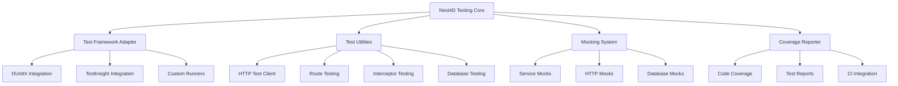
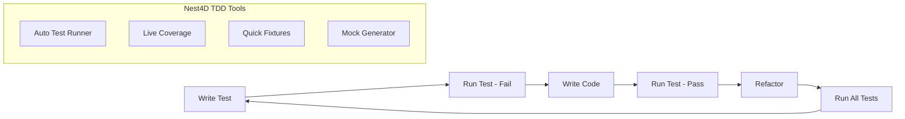

# Sistema de Testes Integrado - Nest4D Framework

## 1. Análise do Mercado Atual

### 1.1 Panorama das Ferramentas de Teste em Delphi

O ecossistema Delphi possui várias soluções para testes unitários, cada uma com características específicas:

#### **DUnitX** - Framework Moderno

* **Características**: Framework baseado em atributos, inspirado no NUnit

* **Recursos**: Testes baseados em atributos, Assert Class extensiva, Setup/TearDown por método e fixture

* **Compatibilidade**: Delphi 2010+, Win32/Win64/macOS/Linux

* **Integração CI**: Saída compatível com NUnit e JUnit

* **Status**: Ativo, integrado ao RAD Studio

#### **TestInsight** - Plugin IDE

* **Características**: Plugin IDE para experiência TDD aprimorada

* **Recursos**: Execução contínua, navegação por clique duplo, execução automática ao salvar

* **Compatibilidade**: Delphi XE+, suporta DUnit, DUnit2 e DUnitX

* **Diferencial**: Integração nativa com IDE, experiência TDD fluida

* **Status**: Ativo, desenvolvido por Stefan Glienke

#### **DUnit** - Framework Clássico

* **Características**: Framework tradicional, baseado em herança

* **Recursos**: TTestCase base, métodos Published, GUI Runner

* **Limitações**: Não suporta recursos modernos (Generics, Atributos)

* **Status**: Legado, ainda amplamente usado

#### **Delphi-Mocks** - Framework de Mocking

* **Características**: Sistema de mocking para isolamento de dependências

* **Recursos**: Criação de objetos mock, verificação de chamadas

* **Integração**: Funciona com DUnitX e DUnit

* **Status**: Ativo, essencial para testes unitários efetivos

### 1.2 Lacunas Identificadas

1. **Fragmentação**: Múltiplas ferramentas sem integração unificada
2. **Configuração Complexa**: Setup manual para cada projeto
3. **Falta de Padronização**: Diferentes abordagens e convenções
4. **Ausência de Métricas**: Pouco suporte nativo para cobertura de código
5. **Integração Framework**: Nenhuma solução específica para frameworks web

## 2. Problema Atual no Nest4D

### 2.1 Framework de Testes Não Integrado

**Sintomas do Problema:**

* Desenvolvedores precisam configurar testes manualmente

* Falta de convenções específicas para APIs REST

* Ausência de utilitários para testar interceptors, middlewares e rotas

* Configuração dispersa entre diferentes ferramentas

* Dificuldade para implementar TDD de forma fluida

**Impacto no Desenvolvimento:**

* Redução na adoção de práticas TDD

* Inconsistência na qualidade dos testes

* Tempo excessivo gasto em configuração

* Baixa cobertura de código

* Dificuldade para testar componentes específicos do framework

## 3. Solução Proposta: Sistema de Testes Integrado

### 3.1 Arquitetura da Solução



### 3.2 Componentes Principais

#### **3.2.1 Nest4D Testing Core**

```pascal
unit nest4d.testing.core;

interface

type
  TNest4DTestConfig = record
    Framework: TNest4DTestFramework; // DUnitX, DUnit, Custom
    EnableMocking: Boolean;
    EnableCoverage: Boolean;
    EnableTestInsight: Boolean;
    TestDataPath: string;
    MockDataPath: string;
    ReportsPath: string;
  end;

  INest4DTestSuite = interface
    ['{B8F5E2A1-9C3D-4E5F-8A7B-1234567890AB}']
    procedure SetupTestEnvironment;
    procedure TearDownTestEnvironment;
    procedure RegisterTestClasses;
    procedure RunTests;
    function GetTestResults: TNest4DTestResults;
  end;
```

#### **3.2.2 HTTP Test Client**

```pascal
unit nest4d.testing.http;

interface

type
  TNest4DTestClient = class
  private
    FBaseURL: string;
    FHeaders: TStringList;
  public
    constructor Create(const ABaseURL: string);
    
    // HTTP Methods
    function Get(const APath: string): TNest4DTestResponse;
    function Post(const APath: string; const ABody: string): TNest4DTestResponse;
    function Put(const APath: string; const ABody: string): TNest4DTestResponse;
    function Delete(const APath: string): TNest4DTestResponse;
    
    // Assertions
    procedure AssertStatusCode(const AResponse: TNest4DTestResponse; AExpected: Integer);
    procedure AssertContentType(const AResponse: TNest4DTestResponse; const AExpected: string);
    procedure AssertJsonPath(const AResponse: TNest4DTestResponse; const APath, AExpected: string);
  end;
```

#### **3.2.3 Route Testing Utilities**

```pascal
unit nest4d.testing.routes;

interface

type
  TNest4DRouteTest = class
  public
    class procedure TestRoute(const AMethod, APath: string; 
      const AExpectedStatus: Integer; const ABody: string = '');
    class procedure TestRouteWithAuth(const AMethod, APath, AToken: string; 
      const AExpectedStatus: Integer);
    class procedure TestRouteValidation(const AMethod, APath: string; 
      const AInvalidData: string; const AExpectedErrors: TArray<string>);
  end;
```

#### **3.2.4 Mocking System**

```pascal
unit nest4d.testing.mocks;

interface

type
  TNest4DMockService = class
  private
    FMocks: TDictionary<string, TObject>;
  public
    function CreateMock<T: class>: T;
    procedure RegisterMock<T: class>(const AMock: T);
    function GetMock<T: class>: T;
    procedure VerifyMockCalls<T: class>(const AMethodName: string; AExpectedCalls: Integer);
  end;
  
  TNest4DHttpMock = class
  public
    procedure MockEndpoint(const AMethod, APath: string; 
      const AResponse: string; AStatusCode: Integer = 200);
    procedure MockEndpointWithDelay(const AMethod, APath: string; 
      const AResponse: string; ADelayMs: Integer; AStatusCode: Integer = 200);
    procedure MockEndpointWithError(const AMethod, APath: string; 
      AStatusCode: Integer; const AErrorMessage: string = '');
  end;
```

### 3.3 Integração com Ferramentas Existentes

#### **3.3.1 Adaptador DUnitX**

```pascal
unit nest4d.testing.dunitx;

interface

uses
  DUnitX.TestFramework,
  nest4d.testing.core;

type
  [TestFixture]
  TNest4DBaseTest = class
  private
    FTestClient: TNest4DTestClient;
    FMockService: TNest4DMockService;
  protected
    property TestClient: TNest4DTestClient read FTestClient;
    property MockService: TNest4DMockService read FMockService;
  public
    [Setup]
    procedure Setup; virtual;
    [TearDown]
    procedure TearDown; virtual;
  end;
```

#### **3.3.2 Integração TestInsight**

```pascal
unit nest4d.testing.testinsight;

interface

{$IFDEF TESTINSIGHT}
uses
  TestInsight.DUnitX;
{$ENDIF}

type
  TNest4DTestInsightRunner = class
  public
    class procedure RunTests;
    class procedure RunTestsWithCoverage;
    class procedure RunTestsContinuous;
  end;
```

### 3.4 Sistema de Fixtures e Test Data

#### **3.4.1 Database Fixtures**

```pascal
unit nest4d.testing.fixtures;

interface

type
  TNest4DFixture = class
  private
    FFixtureData: TJSONObject;
  public
    constructor Create(const AFixtureFile: string);
    procedure LoadFixture(const ATableName: string);
    procedure CleanupFixture(const ATableName: string);
    function GetFixtureData(const AKey: string): TJSONValue;
  end;
  
  TNest4DTestDatabase = class
  public
    procedure BeginTransaction;
    procedure RollbackTransaction;
    procedure SeedTestData(const AFixtures: TArray<string>);
    procedure CleanTestData;
  end;
```

### 3.5 Sistema de Relatórios e Cobertura

#### **3.5.1 Coverage Reporter**

```pascal
unit nest4d.testing.coverage;

interface

type
  TNest4DCoverageConfig = record
    EnableCoverage: Boolean;
    IncludePaths: TArray<string>;
    ExcludePaths: TArray<string>;
    OutputFormat: TCoverageFormat; // HTML, XML, JSON
    MinimumCoverage: Double;
  end;
  
  TNest4DCoverageReporter = class
  public
    procedure StartCoverage;
    procedure StopCoverage;
    procedure GenerateReport(const AConfig: TNest4DCoverageConfig);
    function GetCoveragePercentage: Double;
  end;
```

#### **3.5.2 Test Reporter**

```pascal
unit nest4d.testing.reporter;

interface

type
  TNest4DTestReporter = class
  public
    procedure GenerateHTMLReport(const AResults: TNest4DTestResults);
    procedure GenerateJUnitReport(const AResults: TNest4DTestResults);
    procedure GenerateJSONReport(const AResults: TNest4DTestResults);
    procedure SendSlackNotification(const AResults: TNest4DTestResults);
  end;
```

## 4. Implementação TDD Facilitada

### 4.1 Workflow TDD Integrado



### 4.2 Convenções e Templates

#### **4.2.1 Template de Teste de Controller**

```pascal
unit Test.Controllers.UserController;

interface

uses
  DUnitX.TestFramework,
  nest4d.testing.dunitx,
  Controllers.UserController;

type
  [TestFixture]
  TTestUserController = class(TNest4DBaseTest)
  private
    FController: TUserController;
  public
    [Setup]
    procedure Setup; override;
    [TearDown]
    procedure TearDown; override;
    
    [Test]
    [TestCase('Valid User', 'john@example.com,John Doe,201')]
    [TestCase('Invalid Email', 'invalid-email,John Doe,400')]
    procedure TestCreateUser(const AEmail, AName: string; AExpectedStatus: Integer);
    
    [Test]
    procedure TestGetUser_WhenExists_ReturnsUser;
    
    [Test]
    procedure TestGetUser_WhenNotExists_Returns404;
  end;
```

#### **4.2.2 Template de Teste de Service**

```pascal
unit Test.Services.UserService;

interface

uses
  DUnitX.TestFramework,
  nest4d.testing.dunitx,
  Services.UserService;

type
  [TestFixture]
  TTestUserService = class(TNest4DBaseTest)
  private
    FService: TUserService;
    FMockRepository: IUserRepository;
  public
    [Setup]
    procedure Setup; override;
    
    [Test]
    procedure TestCreateUser_WithValidData_ReturnsUser;
    
    [Test]
    procedure TestCreateUser_WithDuplicateEmail_ThrowsException;
  end;
```

### 4.3 Geração Automática de Testes

#### **4.3.1 Test Generator**

```pascal
unit nest4d.testing.generator;

interface

type
  TNest4DTestGenerator = class
  public
    class procedure GenerateControllerTests(const AControllerClass: TClass);
    class procedure GenerateServiceTests(const AServiceClass: TClass);
    class procedure GenerateRepositoryTests(const ARepositoryClass: TClass);
    class procedure GenerateIntegrationTests(const AModuleClass: TClass);
  end;
```

## 5. Configuração e Setup

### 5.1 Configuração Automática

#### **5.1.1 Nest4D Test Configuration**

```pascal
unit nest4d.testing.config;

interface

type
  TNest4DTestingConfig = record
    // Framework Settings
    TestFramework: TNest4DTestFramework;
    EnableTestInsight: Boolean;
    EnableCoverage: Boolean;
    
    // Database Settings
    TestDatabaseConnection: string;
    UseTransactions: Boolean;
    SeedTestData: Boolean;
    
    // HTTP Settings
    TestServerPort: Integer;
    EnableHTTPMocking: Boolean;
    
    // Reporting Settings
    GenerateHTMLReports: Boolean;
    GenerateJUnitReports: Boolean;
    EnableSlackNotifications: Boolean;
    
    // Paths
    TestDataPath: string;
    FixturesPath: string;
    ReportsPath: string;
  end;
```

#### **5.1.2 Auto Setup Wizard**

```pascal
unit nest4d.testing.wizard;

interface

type
  TNest4DTestWizard = class
  public
    class procedure SetupTestingEnvironment(const AProjectPath: string);
    class procedure CreateTestProject(const AMainProject: string);
    class procedure InstallTestDependencies;
    class procedure ConfigureTestInsight;
    class procedure GenerateTestTemplates;
  end;
```

### 5.2 Integração com Build System

#### **5.2.1 MSBuild Integration**

```xml
<!-- Nest4D.Testing.targets -->
<Project>
  <PropertyGroup>
    <Nest4DTestingEnabled Condition="'$(Nest4DTestingEnabled)' == ''">true</Nest4DTestingEnabled>
    <Nest4DTestFramework Condition="'$(Nest4DTestFramework)' == ''">DUnitX</Nest4DTestFramework>
  </PropertyGroup>
  
  <Target Name="RunNest4DTests" BeforeTargets="Build" Condition="'$(Nest4DTestingEnabled)' == 'true'">
    <Exec Command="$(OutputPath)$(AssemblyName).exe --testinsight" />
  </Target>
</Project>
```

## 6. Benefícios da Solução

### 6.1 Para Desenvolvedores

1. **Setup Simplificado**: Configuração automática com um comando
2. **TDD Fluido**: Ferramentas integradas para ciclo red-green-refactor
3. **Testes Específicos**: Utilitários para testar componentes do framework
4. **Feedback Rápido**: Execução contínua com TestInsight
5. **Mocking Integrado**: Sistema de mocks específico para APIs REST

### 6.2 Para Projetos

1. **Qualidade Consistente**: Padrões e convenções estabelecidas
2. **Cobertura Visível**: Relatórios automáticos de cobertura
3. **CI/CD Ready**: Integração nativa com pipelines
4. **Documentação Viva**: Testes como documentação executável
5. **Refatoração Segura**: Confiança para mudanças no código

### 6.3 Para Equipes

1. **Padronização**: Mesma abordagem em todos os projetos
2. **Onboarding Rápido**: Novos desenvolvedores produtivos rapidamente
3. **Colaboração**: Testes como linguagem comum
4. **Qualidade Mensurável**: Métricas objetivas de qualidade
5. **Entrega Confiável**: Redução de bugs em produção

## 7. Roadmap de Implementação

### 7.1 Fase 1 - Core Testing (4 semanas)

* [ ] Implementar TNest4DTestingCore

* [ ] Criar adaptadores para DUnitX e DUnit

* [ ] Desenvolver HTTP Test Client

* [ ] Implementar sistema básico de mocking

### 7.2 Fase 2 - Integração IDE (3 semanas)

* [ ] Integração com TestInsight

* [ ] Wizard de setup automático

* [ ] Templates de teste

* [ ] Gerador automático de testes

### 7.3 Fase 3 - Fixtures e Database (3 semanas)

* [ ] Sistema de fixtures

* [ ] Database testing utilities

* [ ] Test data management

* [ ] Transaction handling

### 7.4 Fase 4 - Relatórios e CI (2 semanas)

* [ ] Coverage reporter

* [ ] HTML/JUnit reports

* [ ] CI/CD integration

* [ ] Slack notifications

### 7.5 Fase 5 - Documentação e Exemplos (2 semanas)

* [ ] Documentação completa

* [ ] Exemplos práticos

* [ ] Guias de migração

* [ ] Best practices

## 8. Conclusão

O Sistema de Testes Integrado do Nest4D resolverá o problema fundamental de framework de testes não integrado, proporcionando:

* **Experiência TDD Nativa**: Ferramentas específicas para desenvolvimento orientado a testes

* **Integração Transparente**: Funciona com ferramentas existentes (DUnitX, TestInsight)

* **Produtividade Aumentada**: Setup automático e utilitários especializados

* **Qualidade Garantida**: Cobertura, relatórios e métricas integradas

* **Escalabilidade**: Suporte desde projetos pequenos até aplicações enterprise

Esta solução posicionará o Nest4D como o framework Delphi mais avançado em termos de suporte a testes, facilitando a adoção de práticas modernas de desenvolvimento e garantindo a qualidade do software produzido.
