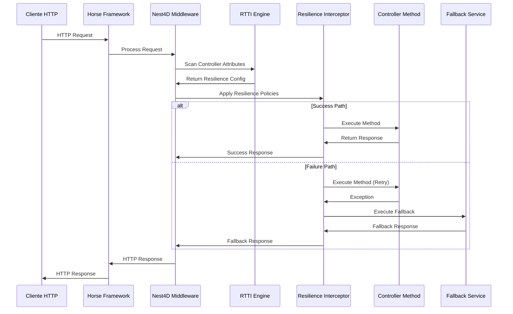

# Arquitetura e Fluxo do Sistema de Resiliência Nest4D

## 1. Visão Geral do Fluxo de Execução

O sistema de resiliência do Nest4D funciona através de uma arquitetura em camadas que intercepta requisições desde a entrada do Horse até a execução dos controllers, aplicando políticas de resiliência de forma transparente.



## 2. Entrada pelo Horse Framework

### 2.1 Configuração Inicial

```pascal
// Configuração do Horse com Nest4D
begin
  // Configuração de resiliência
  var Config := TNest4DHorseConfig.Create;
  Config.EnableResilience := True;
  Config.ResilienceConfig := TResilienceConfigFactory.CreateHighAvailability;
  
  // Inicialização do Nest4D com Horse
  Nest4D_Horse(Config);
  
  // Registro de rotas (automático via RTTI)
  THorse.Get('/api/users/:id', Middleware);
  THorse.Post('/api/orders', Middleware);
end;
```

### 2.2 Middleware Principal

O middleware do Nest4D é o ponto de entrada onde toda requisição HTTP é interceptada:

```pascal
procedure Middleware(Req: THorseRequest; Res: THorseResponse; Next: TProc);
var
  RequestId: string;
  StartTime: TDateTime;
  Context: IInterceptorContext;
begin
  // 1. Geração de ID único para rastreamento
  RequestId := GenerateRequestId;
  
  // 2. Criação do contexto de interceptação
  Context := TInterceptorContext.Create(Req, Res, RequestId);
  
  // 3. Aplicação dos interceptors (incluindo resiliência)
  GInterceptorManager.ExecuteInterceptors(Context);
  
  // 4. Continuação do pipeline
  Next;
end;
```

## 3. Mapeamento RTTI dos Atributos

### 3.1 Detecção de Atributos de Resiliência

O sistema utiliza RTTI para escanear controllers e detectar atributos de resiliência:

```pascal
// Exemplo de Controller com atributos
[Controller('/api/users')]
TUserController = class
public
  [Get('/:id')]
  [Retry(MaxAttempts: 3, BackoffType: btExponential)]
  [CircuitBreaker(FailureThreshold: 5, TimeoutMs: 30000)]
  [Fallback('GetUserFallback')]
  function GetUser(const Id: string): IActionResult;
  
  [Fallback]
  function GetUserFallback(const Id: string): IActionResult;
end;
```

### 3.2 Processo de Reflexão

```pascal
// Escaneamento RTTI no TResilienceInterceptor
function TResilienceInterceptor.ScanMethodAttributes(Method: TRttiMethod): TEndpointResilienceConfig;
var
  Attr: TCustomAttribute;
  Config: TEndpointResilienceConfig;
begin
  Config := TEndpointResilienceConfig.Create;
  
  // Escanear todos os atributos do método
  for Attr in Method.GetAttributes do
  begin
    // Detectar atributo [Retry]
    if Attr is RetryAttribute then
    begin
      var RetryAttr := RetryAttribute(Attr);
      Config.RetryPolicy := TRetryPolicyFactory.Create(
        RetryAttr.MaxAttempts,
        RetryAttr.BackoffType,
        RetryAttr.BaseDelayMs
      );
    end
    
    // Detectar atributo [CircuitBreaker]
    else if Attr is CircuitBreakerAttribute then
    begin
      var CBAttr := CircuitBreakerAttribute(Attr);
      Config.CircuitBreaker := TCircuitBreakerFactory.Create(
        CBAttr.FailureThreshold,
        CBAttr.TimeoutMs,
        CBAttr.RecoveryTimeMs
      );
    end
    
    // Detectar atributo [Fallback]
    else if Attr is FallbackAttribute then
    begin
      var FallbackAttr := FallbackAttribute(Attr);
      Config.FallbackService := TFallbackService.Create(
        FallbackAttr.MethodName
      );
    end;
  end;
  
  Result := Config;
end;
```

### 3.3 Cache de Metadados

Para otimizar performance, os metadados são cacheados:

```pascal
// Cache de configurações por endpoint
FEndpointConfigs: TDictionary<string, TEndpointResilienceConfig>;

function TResilienceInterceptor.GetEndpointConfig(const Route: string): TEndpointResilienceConfig;
begin
  // Verificar cache primeiro
  if FEndpointConfigs.TryGetValue(Route, Result) then
    Exit;
    
  // Se não encontrado, escanear via RTTI
  Result := ScanControllerForRoute(Route);
  
  // Adicionar ao cache
  FEndpointConfigs.Add(Route, Result);
end;
```

## 4. Integração com Interceptors

### 4.1 Pipeline de Interceptors

O `TResilienceInterceptor` é integrado ao pipeline de interceptors do Nest4D:

```pascal
// Ordem de execução dos interceptors
1. LoggingInterceptor (entrada)
2. MetricsInterceptor (métricas)
3. ResilienceInterceptor (resiliência) ← AQUI
4. CacheInterceptor (cache)
5. Controller Method (execução)
6. CacheInterceptor (saída)
7. MetricsInterceptor (métricas finais)
8. LoggingInterceptor (saída)
```

### 4.2 Execução do Interceptor de Resiliência

```pascal
function TResilienceInterceptor.Intercept(Context: IInterceptorContext): Boolean;
var
  Config: TEndpointResilienceConfig;
  Attempt: Integer;
  LastException: Exception;
begin
  // 1. Obter configuração do endpoint
  Config := GetEndpointConfig(Context.Route);
  
  if not Config.Enabled then
  begin
    Result := True; // Continuar sem resiliência
    Exit;
  end;
  
  // 2. Verificar Circuit Breaker
  if Assigned(Config.CircuitBreaker) and 
     Config.CircuitBreaker.IsOpen then
  begin
    // Circuit aberto - executar fallback
    ExecuteFallback(Context, Config);
    Result := False; // Não continuar pipeline
    Exit;
  end;
  
  // 3. Executar com retry policy
  for Attempt := 1 to Config.RetryPolicy.MaxAttempts do
  begin
    try
      // Incrementar contador de requisições ativas
      AtomicIncrement(FActiveRequests);
      
      // Executar próximo interceptor/controller
      Result := ExecuteNext(Context);
      
      if Result then
      begin
        // Sucesso - registrar no Circuit Breaker
        if Assigned(Config.CircuitBreaker) then
          Config.CircuitBreaker.RecordSuccess;
          
        UpdateMetrics(Context.Route, True, Attempt);
        Exit; // Sucesso
      end;
      
    except
      on E: Exception do
      begin
        LastException := E;
        
        // Registrar falha no Circuit Breaker
        if Assigned(Config.CircuitBreaker) then
          Config.CircuitBreaker.RecordFailure;
          
        // Se não é a última tentativa, aguardar backoff
        if Attempt < Config.RetryPolicy.MaxAttempts then
          Sleep(Config.RetryPolicy.CalculateDelay(Attempt));
      end;
    finally
      AtomicDecrement(FActiveRequests);
    end;
  end;
  
  // 4. Todas as tentativas falharam - executar fallback
  UpdateMetrics(Context.Route, False, Config.RetryPolicy.MaxAttempts);
  ExecuteFallback(Context, Config);
  Result := False;
end;
```

## 5. Exemplo Prático Passo a Passo

### 5.1 Cenário: Busca de Usuário com Resiliência

```pascal
// 1. Controller com atributos de resiliência
[Controller('/api/users')]
TUserController = class
public
  [Get('/:id')]
  [Retry(MaxAttempts: 3, BackoffType: btExponential, BaseDelayMs: 1000)]
  [CircuitBreaker(FailureThreshold: 5, TimeoutMs: 30000)]
  [Fallback('GetUserFromCache')]
  function GetUser(const Id: string): IActionResult;
  
  [Fallback]
  function GetUserFromCache(const Id: string): IActionResult;
end;
```

### 5.2 Fluxo de Execução

**Passo 1: Requisição HTTP**
```http
GET /api/users/123 HTTP/1.1
Host: localhost:9000
```

**Passo 2: Horse recebe e chama Middleware**
```pascal
// Horse direciona para o middleware do Nest4D
THorse.Get('/api/users/:id', Middleware);
```

**Passo 3: Middleware cria contexto**
```pascal
// Criação do contexto de interceptação
var Context := TInterceptorContext.Create;
Context.Route := '/api/users/:id';
Context.Method := 'GET';
Context.Parameters.Add('id', '123');
```

**Passo 4: RTTI escaneia atributos**
```pascal
// ResilienceInterceptor escaneia o método GetUser
var Config := ScanMethodAttributes(GetUserMethod);
// Config agora contém:
// - RetryPolicy: 3 tentativas, backoff exponencial
// - CircuitBreaker: 5 falhas para abrir, timeout 30s
// - FallbackService: método GetUserFromCache
```

**Passo 5: Aplicação das políticas**
```pascal
// Primeira tentativa
try
  Result := UserService.GetUser('123'); // Falha (timeout)
except
  // Aguarda 1000ms (backoff)
  Sleep(1000);
end;

// Segunda tentativa
try
  Result := UserService.GetUser('123'); // Falha novamente
except
  // Aguarda 2000ms (backoff exponencial)
  Sleep(2000);
end;

// Terceira tentativa
try
  Result := UserService.GetUser('123'); // Falha pela terceira vez
except
  // Executa fallback
  Result := GetUserFromCache('123');
end;
```

**Passo 6: Resposta**
```json
{
  "id": "123",
  "name": "João Silva",
  "email": "joao@email.com",
  "source": "cache",
  "resilience": {
    "attempts": 3,
    "fallback_used": true,
    "circuit_breaker_state": "closed"
  }
}
```

## 6. Métricas e Monitoramento

### 6.1 Coleta de Métricas

```pascal
// Métricas coletadas automaticamente
type
  TResilienceMetrics = record
    TotalRequests: Int64;
    SuccessfulRequests: Int64;
    FailedRequests: Int64;
    FallbackExecutions: Int64;
    AverageResponseTime: Double;
    CircuitBreakerTrips: Int64;
    RetryAttempts: Int64;
  end;
```

### 6.2 Endpoint de Métricas

```pascal
// Endpoint automático para métricas
THorse.Get('/resilience', 
  procedure(Req: THorseRequest; Res: THorseResponse; Next: TProc)
  begin
    var Metrics := GResilienceInterceptor.GetAllMetrics;
    Res.Send<TJSONObject>(MetricsToJSON(Metrics));
  end
);
```

## 7. Configurações Flexíveis

### 7.1 Configurações Pré-definidas

```pascal
// Configuração para alta disponibilidade
var Config := TResilienceConfigFactory.CreateHighAvailability;
// - Retry: 5 tentativas, backoff exponencial
// - Circuit Breaker: 10 falhas, timeout 60s
// - Timeout: 30s por requisição

// Configuração para fast-fail
var Config := TResilienceConfigFactory.CreateFastFail;
// - Retry: 1 tentativa apenas
// - Circuit Breaker: 3 falhas, timeout 10s
// - Timeout: 5s por requisição
```

### 7.2 Configuração por Endpoint

```pascal
// Configuração específica para endpoints críticos
GResilienceInterceptor.AddEndpointConfig('/api/payments', 
  TResilienceConfigFactory.CreateHighAvailability
);

// Configuração para endpoints de relatório
GResilienceInterceptor.AddEndpointConfig('/api/reports', 
  TResilienceConfigFactory.CreateBulkhead
);
```

## 8. Benefícios da Arquitetura

### 8.1 Transparência
- Aplicação automática sem modificar código existente
- Configuração declarativa via atributos
- Integração seamless com Horse e outros frameworks

### 8.2 Flexibilidade
- Configurações por endpoint ou globais
- Políticas customizáveis via factory patterns
- Suporte a múltiplos frameworks REST

### 8.3 Observabilidade
- Métricas detalhadas em tempo real
- Rastreamento de requisições com IDs únicos
- Logs estruturados de todas as operações

### 8.4 Performance
- Cache de metadados RTTI
- Operações thread-safe otimizadas
- Overhead mínimo quando resiliência está desabilitada

Esta arquitetura garante que o sistema de resiliência seja aplicado de forma consistente e eficiente, desde a entrada da requisição HTTP até a resposta final, proporcionando robustez e confiabilidade para aplicações Delphi modernas.