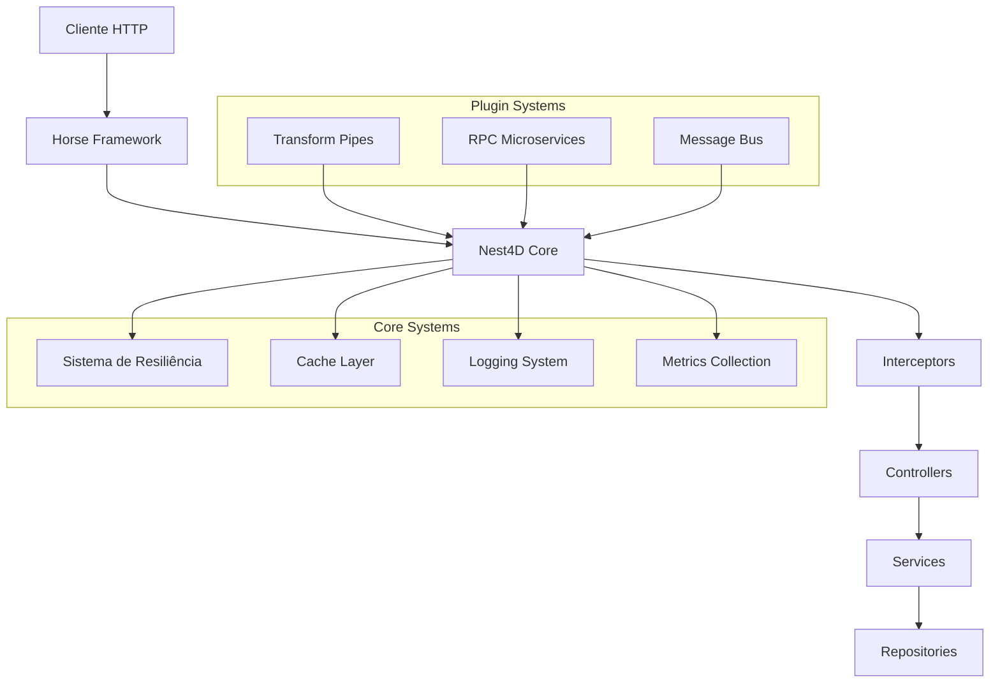

# Arquitetura do Nest4D

O Nest4D é um framework web moderno para Delphi inspirado no NestJS, projetado com uma arquitetura modular e extensível que promove as melhores práticas de desenvolvimento.

## 1. Visão Geral da Arquitetura



## 2. Camadas da Arquitetura

### 2.1 Camada de Apresentação

**Responsabilidades:**
- Recepção de requisições HTTP
- Validação de entrada
- Serialização/Deserialização
- Tratamento de erros

**Componentes:**
- **Horse Framework**: Servidor HTTP base
- **Controllers**: Endpoints da API
- **Guards**: Autenticação e autorização
- **Pipes**: Transformação e validação de dados

```pascal
// Exemplo de Controller
[Route('/api/users')]
TUserController = class(TController)
public
  [Get]
  [UseGuard(TAuthGuard)]
  function GetUsers: TArray<TUser>;
  
  [Post]
  [UsePipe(TValidationPipe)]
  function CreateUser([FromBody] User: TUser): TUser;
end;
```

### 2.2 Camada de Negócio

**Responsabilidades:**
- Lógica de negócio
- Orquestração de operações
- Aplicação de regras
- Coordenação entre serviços

**Componentes:**
- **Services**: Lógica de negócio
- **Interceptors**: Cross-cutting concerns
- **Modules**: Organização e DI

```pascal
// Exemplo de Service
[Injectable]
TUserService = class(TService)
private
  FRepository: IUserRepository;
  FCache: ICacheService;
public
  constructor Create(Repository: IUserRepository; Cache: ICacheService);
  
  [Retry(MaxAttempts: 3)]
  [Cache(TTL: 300)]
  function GetUser(Id: Integer): TUser;
end;
```

### 2.3 Camada de Dados

**Responsabilidades:**
- Persistência de dados
- Cache de dados
- Acesso a recursos externos

**Componentes:**
- **Repositories**: Acesso a dados
- **Cache System**: Cache distribuído
- **External APIs**: Integração com serviços

## 3. Sistemas Core

### 3.1 Sistema de Resiliência

**Componentes:**
- **Circuit Breaker**: Proteção contra falhas em cascata
- **Retry Policy**: Tentativas automáticas
- **Fallback Service**: Serviços alternativos
- **Bulkhead**: Isolamento de recursos

**Estratégias Disponíveis:**
```pascal
// Configurações de resiliência
TResilienceConfig = record
  class function Default: TResilienceConfig; static;
  class function HighAvailability: TResilienceConfig; static;
  class function FastFail: TResilienceConfig; static;
  class function Bulkhead: TResilienceConfig; static;
end;
```

### 3.2 Sistema de Cache

**Características:**
- Cache em memória com TTL
- Thread-safe
- Cleanup automático
- Suporte a tipos genéricos

```pascal
// Uso do cache
FCache.Set<TUser>('user:123', User, 300); // TTL de 5 minutos
var CachedUser := FCache.Get<TUser>('user:123');
```

### 3.3 Sistema de Logging

**Níveis de Log:**
- Trace, Debug, Info, Warning, Error, Fatal
- Structured logging
- Async processing
- Multiple outputs

### 3.4 Sistema de Métricas

**Métricas Coletadas:**
- Request count/duration
- Error rates
- Cache hit/miss
- Circuit breaker states
- Custom business metrics

## 4. Sistemas de Plugins

### 4.1 Transform Pipes

**Arquitetura:**
```pascal
// Interface base
ITransformPipe = interface
  function Transform(const Input: string): TTransformResult;
end;

// Implementação
TJsonBrPipe = class(TTransformPipe)
public
  function Transform(const Input: string): TTransformResult; override;
end;
```

**Plugins Disponíveis:**
- JsonBr: Serialização JSON brasileira
- XML Parser: Transformação XML
- YAML Parser: Suporte a YAML
- Custom Pipes: Extensibilidade total

### 4.2 Microserviços RPC

**Arquitetura:**
```pascal
// Interfaces do sistema RPC
IRPCProviderServer = interface
  procedure Start(const Host: string; Port: Integer);
  procedure Stop;
  procedure PublishRPC(const ServiceName: string; ServiceClass: TRPCResourceClass);
  function ExecuteRPC(const Request: string): string;
end;

IRPCProviderClient = interface
  function ExecuteRPC(const Host: string; Port: Integer; const Request: string): string;
end;
```

**Providers Disponíveis:**
- Indy TCP Provider
- Synapse Provider
- Custom Providers

### 4.3 Message Bus

**Características:**
- Event-driven architecture
- Type-safe callbacks
- Wildcard support
- Async processing

```pascal
// Uso do Message Bus
FMessageBus.Subscribe<TUserCreated>('user.created', 
  procedure(Event: TUserCreated)
  begin
    // Handle event
  end);

FMessageBus.Publish<TUserCreated>('user.created', UserCreatedEvent);
```

## 5. Injeção de Dependência

### 5.1 Container DI

**Escopos Suportados:**
- Singleton: Uma instância por aplicação
- Transient: Nova instância a cada resolução
- Scoped: Uma instância por request

```pascal
// Registro de dependências
Container
  .RegisterSingleton<IUserRepository, TUserRepository>
  .RegisterTransient<IEmailService, TEmailService>
  .RegisterScoped<IUserService, TUserService>;
```

### 5.2 Módulos

**Organização:**
```pascal
TUserModule = class(TModule)
protected
  procedure ConfigureServices(Container: IDIContainer); override;
public
  class function Create: TUserModule;
end;
```

## 6. Middleware Pipeline

### 6.1 Ordem de Execução

1. **Authentication Middleware**
2. **CORS Middleware**
3. **Logging Middleware**
4. **Metrics Middleware**
5. **Resilience Middleware**
6. **Cache Middleware**
7. **Validation Middleware**
8. **Controller Action**

### 6.2 Interceptors

**Tipos de Interceptors:**
- Before: Executado antes da ação
- After: Executado após a ação
- Around: Envolve a execução da ação
- Exception: Tratamento de exceções

```pascal
[Interceptor]
TLoggingInterceptor = class(TInterceptor)
public
  procedure Before(Context: IExecutionContext); override;
  procedure After(Context: IExecutionContext; Result: TValue); override;
  procedure OnException(Context: IExecutionContext; Exception: Exception); override;
end;
```

## 7. Configuração

### 7.1 Sistema Unificado

**Fontes de Configuração:**
- Arquivos JSON
- Variáveis de ambiente
- Argumentos de linha de comando
- Configuração programática

```pascal
// Configuração
TNest4DConfig = class
public
  class function LoadFromFile(const FileName: string): TNest4DConfig;
  class function LoadFromEnvironment: TNest4DConfig;
  procedure EnableHotReload;
end;
```

### 7.2 Ambientes

**Ambientes Suportados:**
- Development
- Testing
- Staging
- Production

## 8. Testes

### 8.1 Framework de Testes

**Componentes:**
- TNest4DTestingCore
- DUnitX Integration
- TestInsight Support
- Mocking Framework

```pascal
// Teste de integração
[TestFixture]
TUserServiceTests = class
private
  FTestingModule: INest4DTestingModule;
  FUserService: IUserService;
public
  [Setup]
  procedure Setup;
  
  [Test]
  procedure Should_Create_User_Successfully;
end;
```

### 8.2 Estratégias de Teste

- **Unit Tests**: Testes isolados de componentes
- **Integration Tests**: Testes de integração entre camadas
- **E2E Tests**: Testes end-to-end da API
- **Performance Tests**: Testes de carga e stress

## 9. Deployment

### 9.1 Estratégias

**Opções de Deploy:**
- Standalone Executable
- Windows Service
- Docker Container
- Cloud Deployment

### 9.2 Monitoramento

**Métricas de Produção:**
- Health checks
- Performance metrics
- Error tracking
- Resource utilization

**Endpoints de Monitoramento:**
- `/health`: Status da aplicação
- `/metrics`: Métricas Prometheus
- `/resilience`: Status dos circuit breakers

## 10. Extensibilidade

### 10.1 Pontos de Extensão

- **Custom Pipes**: Transformação de dados
- **Custom Interceptors**: Cross-cutting concerns
- **Custom Providers**: Integração com serviços
- **Custom Modules**: Funcionalidades específicas

### 10.2 Plugin Development

```pascal
// Plugin personalizado
TCustomPlugin = class(TInterfacedObject, INest4DPlugin)
public
  procedure Initialize(App: INest4DApplication);
  procedure Configure(Container: IDIContainer);
  procedure Shutdown;
end;
```

## 11. Performance

### 11.1 Otimizações

- **Async Processing**: Operações não-bloqueantes
- **Connection Pooling**: Reutilização de conexões
- **Caching Strategy**: Cache inteligente
- **Resource Management**: Gerenciamento eficiente de recursos

### 11.2 Benchmarks

**Métricas Típicas:**
- Throughput: 10,000+ req/s
- Latency: < 10ms (P95)
- Memory Usage: < 100MB base
- CPU Usage: < 20% idle

## 12. Segurança

### 12.1 Recursos de Segurança

- **Authentication**: JWT, OAuth2, Custom
- **Authorization**: Role-based, Policy-based
- **Input Validation**: Automatic sanitization
- **Rate Limiting**: Request throttling
- **CORS**: Cross-origin configuration
- **HTTPS**: TLS/SSL support

### 12.2 Best Practices

- Validação de entrada rigorosa
- Sanitização de dados
- Logging de segurança
- Auditoria de acessos
- Criptografia de dados sensíveis

---

**Nest4D** oferece uma arquitetura robusta e extensível que permite o desenvolvimento de aplicações web modernas e escaláveis em Delphi, seguindo as melhores práticas da indústria.